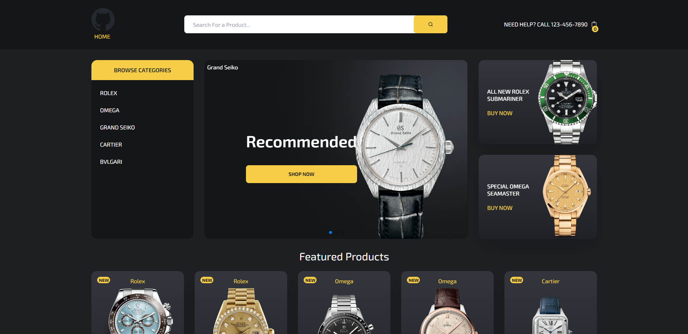
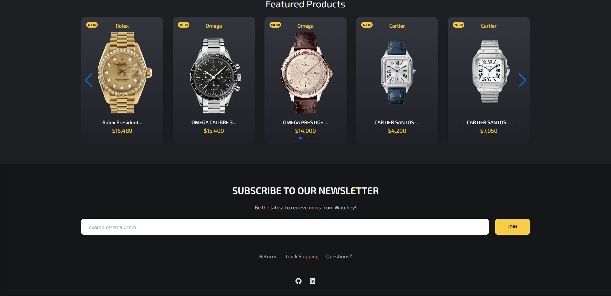
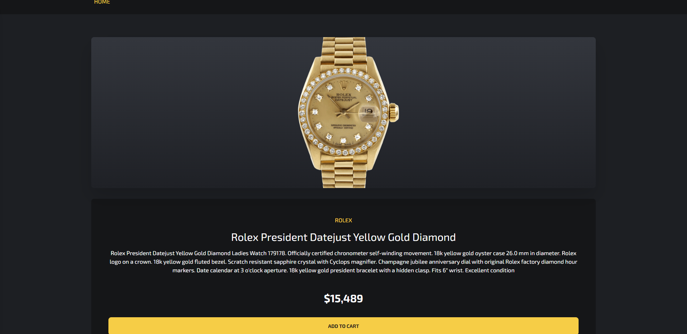
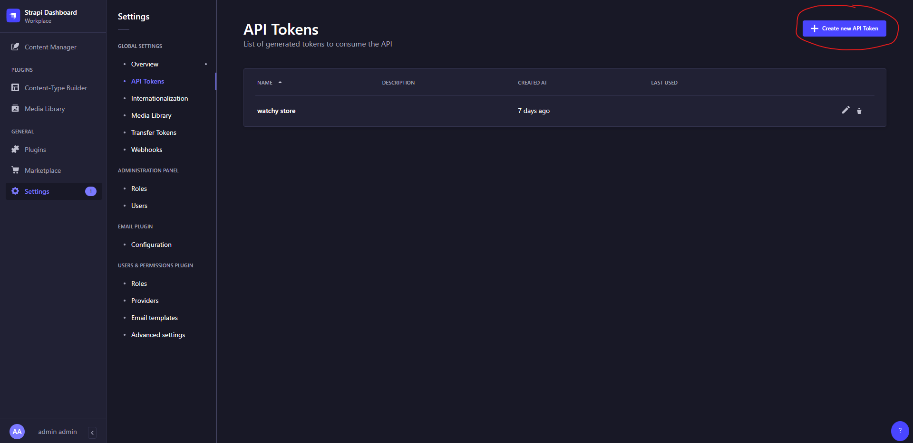
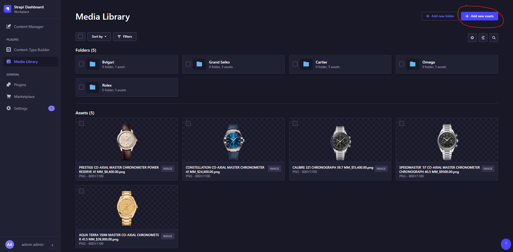
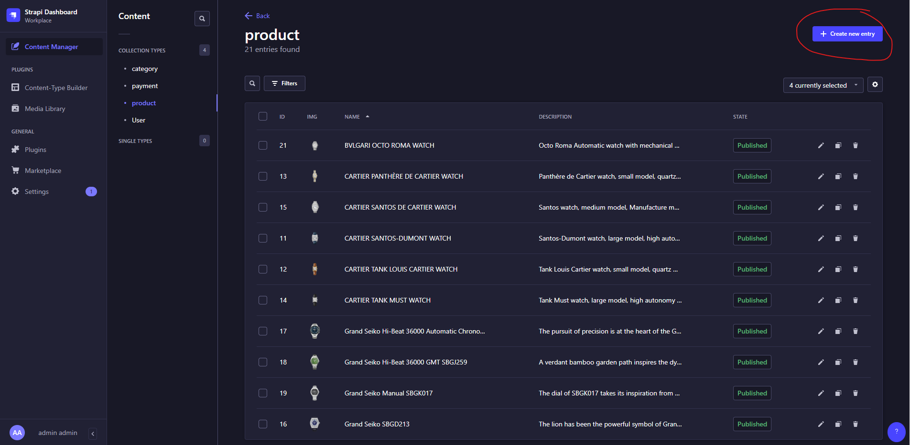
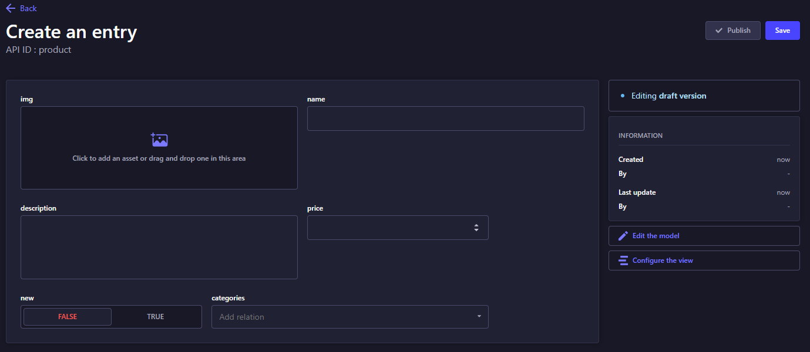
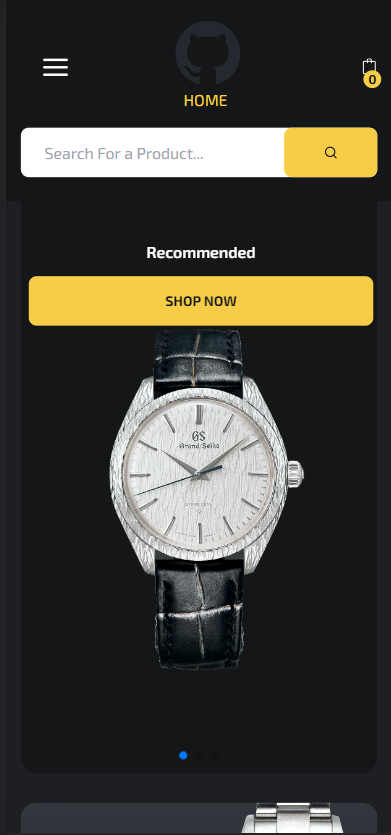
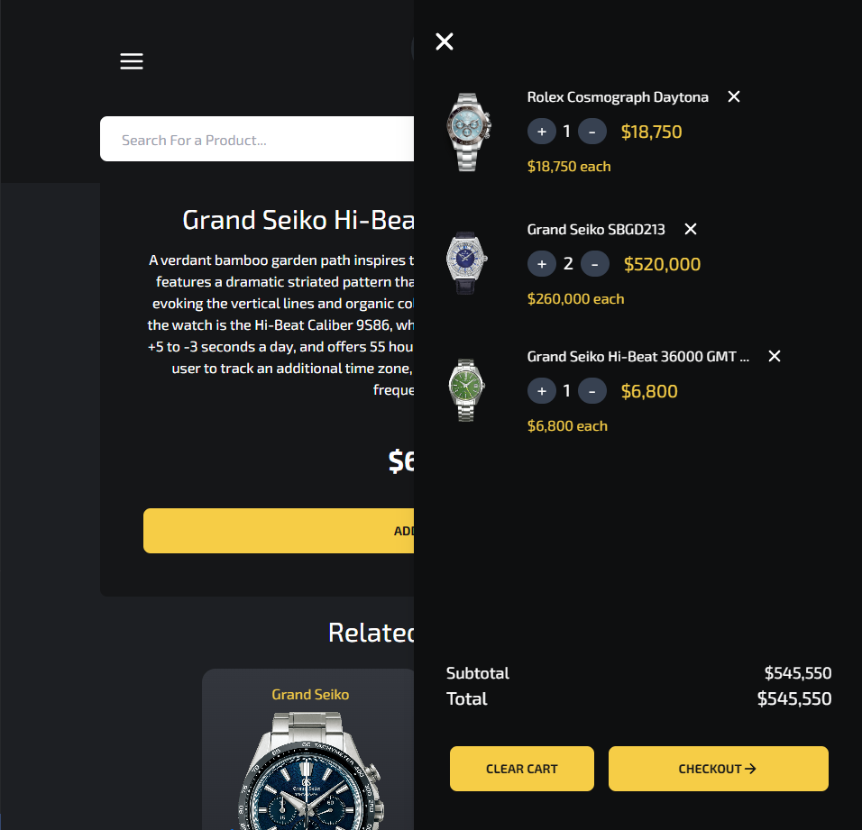
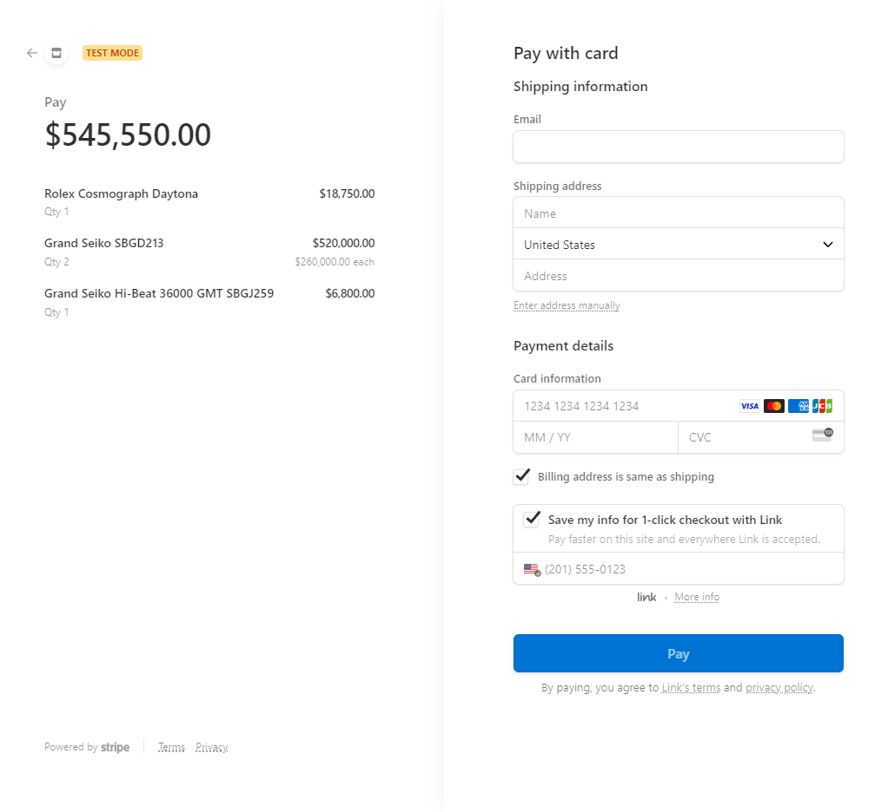

<!-- Improved compatibility of back to top link: See: https://github.com/othneildrew/Best-README-Template/pull/73 -->
<a name="readme-top"></a>
<!--
*** Thanks for checking out the Best-README-Template. If you have a suggestion
*** that would make this better, please fork the repo and create a pull request
*** or simply open an issue with the tag "enhancement".
*** Don't forget to give the project a star!
*** Thanks again! Now go create something AMAZING! :D
-->


[![LinkedIn][linkedin-shield]][linkedin-url]


<!-- PROJECT LOGO -->
<br />
<div align="center">
  <a href="https://github.com/shimupan">
    
  </a>

  <h3 align="center">Watchy</h3>

  <p align="center">
    An online store where you can shop for luxury watches!
    <br />
  </p>
</div>


<!-- ABOUT THE PROJECT -->
## About The Project

### Home Page

<br/>

### Home Page (Cont.)


<br/>

### Footer



<br/>
<br/>
Fullstack e-commerce Store where you can search and purchase expensive luxury watches.
<br/>
Checkouts are made possible using Stripe and a headless CMS used to manage products.
<br/>
Admin panel available, making it easy to add new products whenever needed.
<br/>

<a href="youtube.com">Visit the live Project here!</a>

<p align="right">(<a href="#readme-top">back to top</a>)</p>

### Built With

FrontEnd
* [![React][React.js]][React-url]
* [](https://www.typescriptlang.org/)
<br/>

BackEnd

* Strapi

<p align="right">(<a href="#readme-top">back to top</a>)</p>

<!-- GETTING STARTED -->
## Getting Started

To get a local copy up and running follow these simple example steps.

### Prerequisites

Make sure you have npm installed
* npm
  ```sh
  npm install npm@latest -g
  ```

### Installation

1. Get a free Stripe test API key [here](https://stripe.com/)
2. Clone the repo
   ```sh
   git clone https://github.com/shimupan/Watchey.git
   ```
3. ***IMPORTANT*** `cd` into `strapi_server` first and run
   ```sh
   npm i
   ```
4. After it finishes, `cd ..` into the root directory and run 
   ```
    npm i
   ```

### Setup Strapi Server

1. `cd strapi_server` again and create a .env file with this template
    ```
    HOST=0.0.0.0
    PORT=1337
    APP_KEYS="1,2"
    API_TOKEN_SALT="3"
    ADMIN_JWT_SECRET="4"
    JWT_SECRET="5"
    STRIPE_KEY= YOUR_STRIPE_SECRET_KEY
    CLIENT_URL= URL_OF_VITE_SERVER
    ```

2. `cd strapi_server` again and import necessary data (decryption key is 1)
    ```
    npm run strapi import -- -f ./export_20230724120251.tar.gz.enc
    ```
3. Start the strapi server and head to the admin site
    ```
    npm run develop
    ```
4. Head to `http://localhost:1337` and make an account (credentials dont matter)

5. Go to `settings -> API Tokens -> Create new API Token`

    

    ```
    Name: (any)
    Token duration: Unlimited
    Token type: Full access (important)!!
    ```

6. Copy the API token once you press save and `cd ..` in terminal into the root directory

7. Make a `config.ts` file in the root of the file and populate it with
    ```js
    export const config = {
        STRAPI_API_KEY: "API_KEY_YOU_JUST_COPIED",
        STRAPI_DEFAULT_LINK: "http://localhost:1337/api",
        STRIPE_PUBLIC_KEY: "STRIPE PUBLIC KEY"
    }
    ```

8. Run the following command in a new terminal and the site is live!
    ```
    npm run dev
    ```

## Adding New Content

1. Within Strapi admin panel, upload assets into the `Media Library`

2. Then head to `Content Manager -> product -> Create an entry`

    
    
    ```
    To create a new brand, head to category instead of product and create a new
    entry there with the brand name
    ```
    
3. Fill out the Img, Name, Description, Price, etc.

    
    
    ```
    Important to add relation to a brand
    ```

4. Press save and publish
    ```
    Done! Your product has been uploaded onto the store!
    ```

<p align="right">(<a href="#readme-top">back to top</a>)</p>


<!-- USAGE EXAMPLES -->
## Showcase

### Mobile View



### Cart



### Checkout




<!-- CONTRIBUTING -->
## Contributing

Contributions are what make the community such an amazing place to learn, inspire, and create. Any contributions you make are **greatly appreciated**.


<!-- CONTACT -->
## Contact

Shimu Pan - shimu.pan0@gmail.com

Project Link: [https://github.com/shimupan/Watchey](https://github.com/shimupan/Watchey)

<p align="right">(<a href="#readme-top">back to top</a>)</p>


<!-- MARKDOWN LINKS & IMAGES -->
<!-- https://www.markdownguide.org/basic-syntax/#reference-style-links -->
[contributors-shield]: https://img.shields.io/github/contributors/github_username/repo_name.svg?style=for-the-badge
[contributors-url]: https://github.com/github_username/repo_name/graphs/contributors
[forks-shield]: https://img.shields.io/github/forks/github_username/repo_name.svg?style=for-the-badge
[forks-url]: https://github.com/github_username/repo_name/network/members
[stars-shield]: https://img.shields.io/github/stars/github_username/repo_name.svg?style=for-the-badge
[stars-url]: https://github.com/github_username/repo_name/stargazers
[issues-shield]: https://img.shields.io/github/issues/github_username/repo_name.svg?style=for-the-badge
[issues-url]: https://github.com/github_username/repo_name/issues
[license-shield]: https://img.shields.io/github/license/github_username/repo_name.svg?style=for-the-badge
[license-url]: https://github.com/github_username/repo_name/blob/master/LICENSE.txt
[linkedin-shield]: https://img.shields.io/badge/-LinkedIn-black.svg?style=for-the-badge&logo=linkedin&colorB=555
[linkedin-url]: https://www.linkedin.com/in/shimupan/
[Next.js]: https://img.shields.io/badge/next.js-000000?style=for-the-badge&logo=nextdotjs&logoColor=white
[Next-url]: https://nextjs.org/
[React.js]: https://img.shields.io/badge/React-20232A?style=for-the-badge&logo=react&logoColor=61DAFB
[React-url]: https://reactjs.org/
[Vue.js]: https://img.shields.io/badge/Vue.js-35495E?style=for-the-badge&logo=vuedotjs&logoColor=4FC08D
[Vue-url]: https://vuejs.org/
[Angular.io]: https://img.shields.io/badge/Angular-DD0031?style=for-the-badge&logo=angular&logoColor=white
[Angular-url]: https://angular.io/
[Svelte.dev]: https://img.shields.io/badge/Svelte-4A4A55?style=for-the-badge&logo=svelte&logoColor=FF3E00
[Svelte-url]: https://svelte.dev/
[Laravel.com]: https://img.shields.io/badge/Laravel-FF2D20?style=for-the-badge&logo=laravel&logoColor=white
[Laravel-url]: https://laravel.com
[Bootstrap.com]: https://img.shields.io/badge/Bootstrap-563D7C?style=for-the-badge&logo=bootstrap&logoColor=white
[Bootstrap-url]: https://getbootstrap.com
[JQuery.com]: https://img.shields.io/badge/jQuery-0769AD?style=for-the-badge&logo=jquery&logoColor=white
[JQuery-url]: https://jquery.com 
